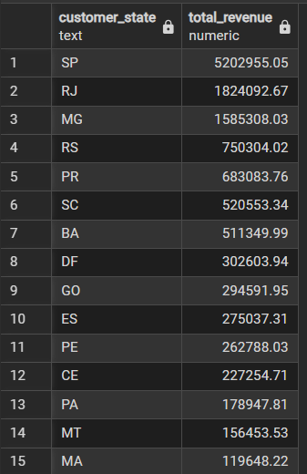
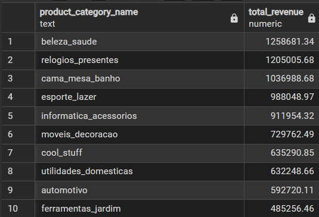
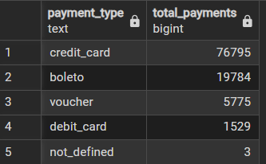
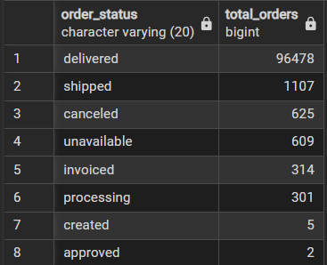
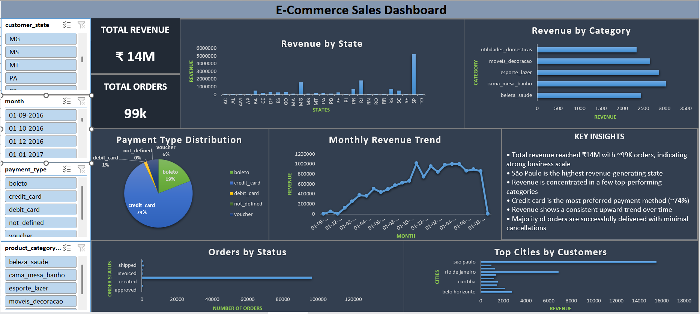

#  E-Commerce Sales Analysis (SQL + Excel Dashboard)

##  Project Overview

This project focuses on analyzing an E-Commerce dataset using **SQL (PostgreSQL)** and building an interactive **Excel dashboard** to extract meaningful business insights.

The goal is to understand:

* Customer purchasing behavior
* Sales trends and patterns
* Revenue distribution across categories
* Payment preferences and order performance

This project simulates real-world business analysis and demonstrates how data can be used to support decision-making.

---

##  Objectives

* Perform data cleaning and preprocessing
* Analyze data using SQL queries
* Generate business insights
* Build an interactive dashboard using Excel

---

##  Tools & Technologies Used

* **SQL (PostgreSQL)** : Data extraction & analysis
* **Microsoft Excel** : Data cleaning, pivot tables & dashboard
* **Git & GitHub** : Version control and project hosting

---

##  Dataset Description

The dataset consists of multiple related tables:

* **customers** : Customer information
* **orders** : Order details (date, status, etc.)
* **order_items** : Product-level details (price, quantity)
* **products** : Product details
* **order_payments** : Payment types and values

---

##  Data Source

The dataset used in this project is the **Brazilian E-commerce Public Dataset (Olist)**, which contains real-world transactional data including orders, customers, products, and payments.

---

##  Database Design

* Created relational schema using PostgreSQL
* Defined Primary Keys and Foreign Keys
* Established relationships between tables

---

##  SQL Analysis

The project includes **39 SQL queries** covering:

* Basic Data Exploration
* Sales & Product Analysis
* Customer & Business Insights
* Advanced SQL (Window Functions)

### Key SQL Concepts Used:

* JOIN operations
* GROUP BY & HAVING
* Subqueries
* Aggregations (SUM, COUNT, AVG)
* Window functions (RANK, ROW_NUMBER, running totals)

 All SQL queries are available in:
`sql/analysis_queries.sql`

---

##  Sample SQL Queries 

### Rank products based on total revenue generated
```sql
SELECT
product_id,
SUM(price) AS total_revenue,
RANK() OVER (ORDER BY SUM(price) DESC) AS revenue_rank
FROM order_items
GROUP BY product_id;
```

### States generating highest revenue
```sql
SELECT
c.customer_state,
SUM(oi.price) AS total_revenue
FROM customers c
JOIN orders o
ON c.customer_id = o.customer_id
JOIN order_items oi
ON o.order_id = oi.order_id
GROUP BY c.customer_state
ORDER BY total_revenue DESC;
```
###  Output



---

##  Sample SQL Analysis result

###  Revenue by Category




###  Payment Distribution




###  Orders by Status



---

##  Excel Dashboard

An interactive dashboard was created using:

* Pivot Tables
* Charts (Bar, Line, KPI Cards)
* Slicers for filtering

### Dashboard Preview:



### Dashboard Highlights:

* Total Revenue & Orders (KPIs)
* Sales performance across regions
* Category-wise revenue analysis
* Payment type distribution
* Customer distribution insights

---

##  Key Insights

* A few product categories contribute a significant portion of total revenue
* São Paulo (SP) generates the highest revenue among all states
* Credit card is the most preferred payment method
* Customer base is concentrated in major cities
* Majority of orders are successfully delivered
* Revenue distribution is highly concentrated in specific regions

 Detailed insights available in:
`insights/business_insights.md`

---

##  Project Workflow

1. Data understanding
2. Data cleaning (SQL + Excel)
3. Data analysis using SQL
4. Export results to Excel
5. Build dashboard
6. Generate insights

---

##  Project Structure

```
ecommerce-sales-analysis
│
├── data
│   ├── raw_data
│   └── processed
│
├── sql
│   ├── schema.sql
│   └── analysis_queries.sql
│
├── dashboard
│   └── ecommerce_dashboard.xlsx
│
├── images
│   ├── dashboard.png
│   ├── revenue_by_category.png
│   ├── payment_distribution.png
│   ├── revenue_by_state.png
│   └── orders_by_status.png
│
├── insights
│   └── business_insights.md
│
└── README.md
```

---

##  Conclusion

This project demonstrates an end-to-end data analysis workflow — from raw data processing to business insight generation and dashboard creation.

It showcases practical skills in SQL, data analysis, and visualization, which are essential for real-world data analyst roles.

---

##  Author

**Jayshree Patidar**

**LinkedIn:** https://www.linkedin.com/in/jayshreepatidar

---